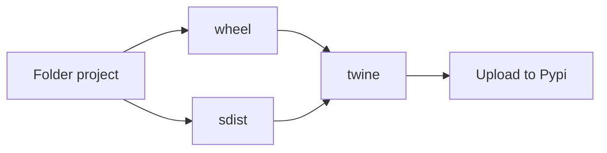

# Create packages and Process Images with Python

## Module VS Package
**Module:** Object that serves as the organizational unit of the code that os loaded by the import command.  
**Packages** Collection of modules with hierarchy
## Modularization
### Advantages of Modularization
- Readability
- Maintenance
- code reuse
## Packagens
### Advantages of create a Package
- Ease of sharing
- Ease of installation

## Consepts
**Pypi:** Official public repository of packages  
**Whell and Sdist:** Distributions type
**Setuptools** package used in setup.py to generate the distributions
**Twine** package used for up the distributions to Pype repository

### Eschema

```shell
project_name
    README.MD
    setup.py
    requirements.txt
    package_name/
        __init__.py
        file_name_1.py
        file_name_2.py
```
```shell
project_name
    README.MD
    setup.py
    requirements.txt
    package_name/
        __init__.py
        module1_name/
            __init__.py
            file_name_1.py
            file_name_2.py
        module2_name/
            __init__.py
            file_name_1.py
            file_name_2.py
```